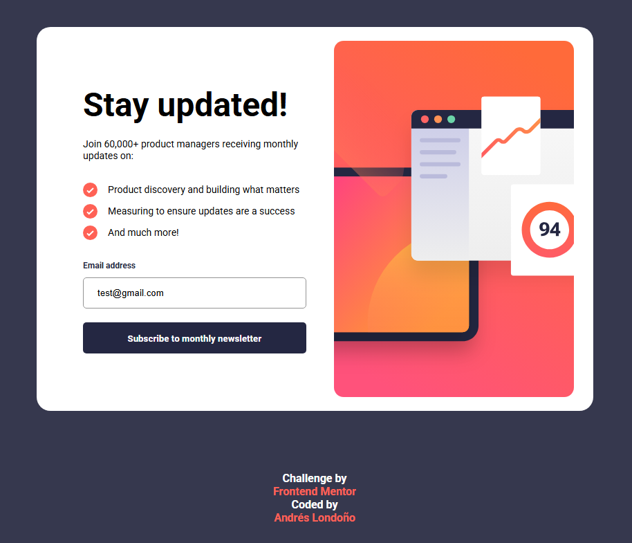
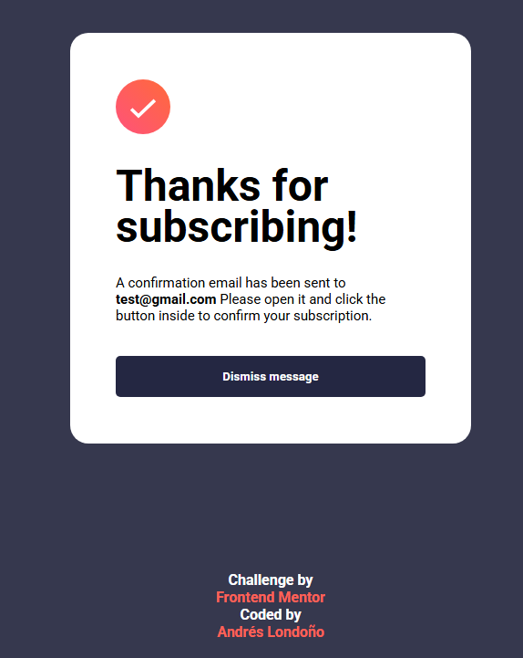
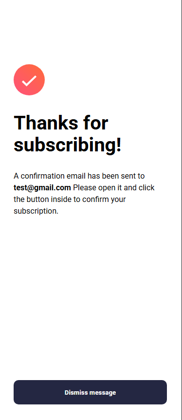
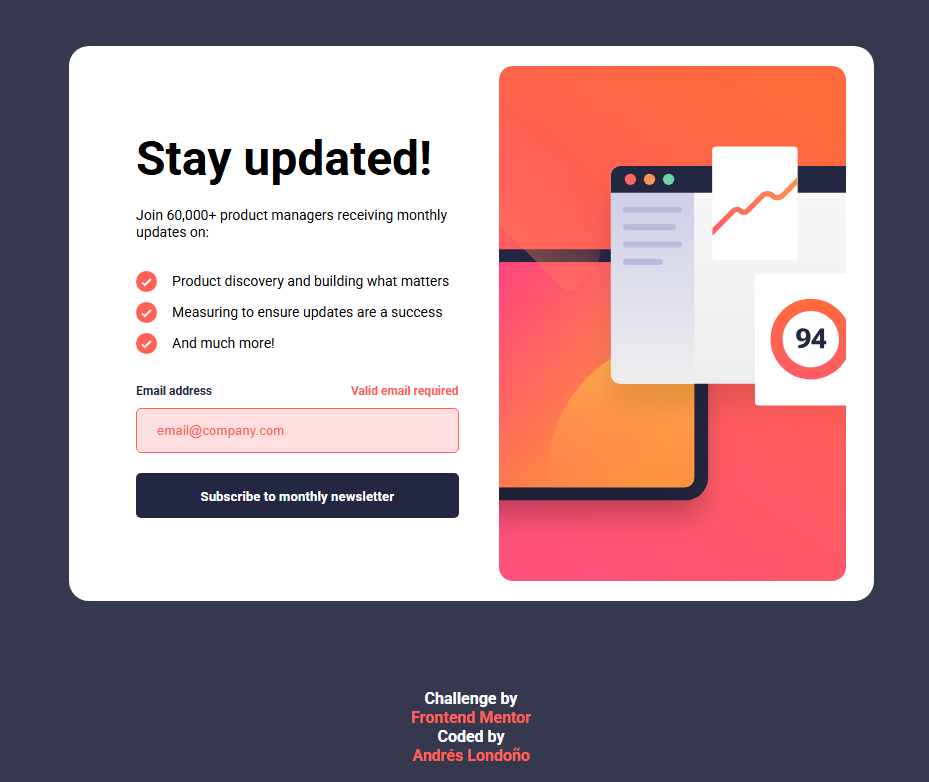

# Frontend Mentor - Newsletter sign-up form with success message solution

This is a solution to the [Newsletter sign-up form with success message challenge on Frontend Mentor](https://www.frontendmentor.io/challenges/newsletter-signup-form-with-success-message-3FC1AZbNrv). Frontend Mentor challenges help you improve your coding skills by building realistic projects. 

## Table of contents

- [Frontend Mentor - Newsletter sign-up form with success message solution](#frontend-mentor---newsletter-sign-up-form-with-success-message-solution)
  - [Table of contents](#table-of-contents)
  - [Overview](#overview)
    - [The challenge](#the-challenge)
    - [Screenshot](#screenshot)
  - [Desktop](#desktop)
  - [Mobile](#mobile)
  - [Email Error Desktop/Mobile](#email-error-desktopmobile)
    - [Links](#links)
  - [My process](#my-process)
    - [Built with](#built-with)
    - [What I learned](#what-i-learned)
  - [Author](#author)

## Overview

### The challenge

Users should be able to:

- Add their email and submit the form
- See a success message with their email after successfully submitting the form
- See form validation messages if:
  - The field is left empty
  - The email address is not formatted correctly
- View the optimal layout for the interface depending on their device's screen size
- See hover and focus states for all interactive elements on the page

### Screenshot

## Desktop




## Mobile




## Email Error Desktop/Mobile




### Links

- Solution URL: [Github](https://github.com/andreslondono00/newsletter-sign-up-with-success-message)

## My process

### Built with

- Semantic HTML5 markup
- CSS custom properties
- Flexbox
- CSS Grid

### What I learned

I learned how to use emailRegex so that when users don't enter the @ symbol, they can't move on to the next field because they have to validate their email address correctly.

```js
function validateEmail(email) {
    const emailRegex = /^[a-zA-Z0-9._%+-]+@[a-zA-Z0-9.-]+\.[a-zA-Z]{2,}$/;
    return emailRegex.test(email);
}
```

## Author

- Frontend Mentor - [@andreslondono00](https://www.frontendmentor.io/profile/andreslondono00)
